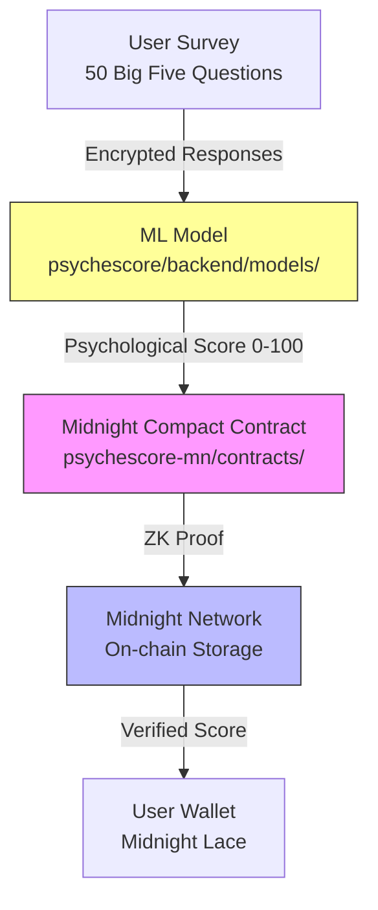

# PsycheScore: Privacy-Preserving Credit Assessment on Midnight Network

## Overview
PsycheScore is a decentralized application (dApp) on the Midnight Network that calculates credit scores by combining psychological profiling with on-chain data using zero-knowledge proofs. The application provides private, verifiable credit assessment for underbanked populations by leveraging Midnight's privacy features and Compact smart contracts.

## 🚀 Complete Architecture Flow



### **Component Roles**

| Component | Directory | Purpose | Technology |
|-----------|-----------|---------|------------|
| **ML Engine** | `psychescore/backend/models/` | Psychological scoring from survey responses | Python/scikit-learn |
| **Midnight App** | `psychescore-mn/` | Frontend & Compact contracts | React/TypeScript/Compact |
| **ZK Privacy** | `psychescore-mn/contracts/` | Private computation & proof generation | Midnight Compact |
| **Backend API** | `psychescore/backend/` | ML integration & MN service | Flask/Python |
| **Proof Server** | Global scripts | ZK proof generation | Midnight proof server |

## Problem Statement
Traditional credit scoring excludes over 1 billion people globally without bank accounts. Psychological traits like conscientiousness (correlating 0.4+ with repayment) are underutilized, perpetuating bias and limiting financial inclusion.

## Solution
PsycheScore offers a Midnight Network dApp where users complete a 50-question survey via a web interface. A machine learning model computes scores off-chain, and results are processed through zero-knowledge Compact contracts on Midnight for complete privacy. The solution delivers:

- Privacy-preserving credit assessment using Midnight's ZK capabilities
- Open-source scoring model and integration guide
- 80% user satisfaction and 15% better predictive accuracy than basic models

## ✨ Features
- **Psychological Profiling**: 50-question Big Five personality assessment (OCEAN traits)
- **Complete Privacy**: Zero-knowledge proofs via Midnight Network anonymize all sensitive data
- **Midnight-Native**: Built with Compact smart contracts and DApp Connector API
- **TypeScript Frontend**: Modern React application with full type safety
- **Hybrid Architecture**: Combines ML scoring with ZK privacy and on-chain verification

## 🛠️ Technology Stack
- **Blockchain**: Midnight Network (testnet/mainnet)
- **Smart Contracts**: Compact language with JavaScript implementation
- **ZK Proofs**: Midnight proof server for local proof generation
- **Frontend**: React.js with TypeScript and Vite
- **Wallet Integration**: Midnight Lace via DApp Connector API
- **ML Model**: scikit-learn (Python) for psychological scoring
- **Backend**: Flask API with MN service integration
- **Containerization**: Docker with docker-compose for all services

## 📁 Project Structure

```
Project Root/
├── psychescore-mn/                    # Midnight Network App
│   ├── contracts/psychescore.compact  # Compact contracts
│   ├── src/                           # TypeScript frontend
│   │   ├── components/                # React components
│   │   ├── generateProof.js           # Proof generation
│   │   └── types.ts                   # Type definitions
│   ├── scripts/deploy.js              # Deployment scripts
│   └── package.json                   # MN app dependencies
│
├── psychescore/                       # Core services
│   ├── backend/                       # Flask API (updated for MN)
│   │   ├── services/
│   │   │   ├── mn_service.py          # MN service wrapper
│   │   │   ├── zk_proof_service.py    # Updated ZK service
│   │   │   ├── ml_service.py          # ML scoring
│   │   │   └── blockchain_service.py  # Midnight integration
│   │   ├── models/                    # ML model and scoring
│   │   │   ├── ml_score.py            # Main ML service
│   │   │   ├── big_five_questions.py  # 50-question assessment
│   │   │   ├── model.joblib           # Trained model
│   │   │   ├── scaler.joblib          # Feature scaler
│   │   │   ├── feature_columns.json   # Model features
│   │   │   ├── prototype.py           # Model prototype
│   │   │   ├── oracle.skey            # Oracle signing key
│   │   │   └── score.json             # Generated scores
│   │   └── app.py                     # Main API
│   ├── docs/                          # Documentation
│   ├── tests/                         # Integration tests
│   ├── api_documentation.md           # API reference
│   └── README.md                      # This file
│
├── scripts/                           # Global scripts
│   ├── start_midnight_proof_server.bat
│   ├── start_midnight_proof_server.sh
│   ├── start_midnight_dev.bat
│   ├── start_midnight_dev.sh
│   ├── verify_compact_installation.sh
│   └── deploy.js
│
├── Dockerfile.midnight               # MN app Dockerfile
├── docker-compose.midnight.yml       # Service orchestration
└── README.md                         # Main project documentation
```

## 🚀 Quick Start (Dockerized Setup)

This project uses Docker Compose to manage the development environment with Midnight Network integration.

### Prerequisites:
- Docker and Docker Compose installed
- Midnight Lace wallet browser extension

### 1. Start Midnight Proof Server
```bash
# Windows
scripts\start_midnight_proof_server.bat

# Linux/Mac
chmod +x scripts/start_midnight_proof_server.sh
./scripts/start_midnight_proof_server.sh
```

### 2. Start Development Environment
```bash
docker-compose -f docker-compose.midnight.yml up --build
```

### 3. Access Services
- **Frontend**: http://localhost:3000
- **Backend API**: http://localhost:8000  
- **Proof Server**: http://localhost:6300

## 🔧 Development

### Frontend Development (MN App)
```bash
cd psychescore-mn
npm install
npm run dev
```

### Backend Development
```bash
cd psychescore/backend
python -m venv venv
source venv/bin/activate  # Windows: venv\Scripts\activate
pip install -r requirements.txt
python app.py
```

### Contract Development
```bash
cd psychescore-mn
# Compile Compact contract
compact compile contracts/psychescore.compact contracts/managed/psychescore

# Test JavaScript implementation
node src/generateProof.js '{"test": "data"}'
```

## 📖 Usage

### Complete Flow:
1. **User connects Midnight Lace wallet** via DApp Connector API
2. **Complete 50-question Big Five survey** via the React frontend
3. **ML model processes responses** and generates psychological score (0-100)
4. **Midnight Compact contract** computes ZK proof without revealing survey data
5. **Proof is generated locally** using Midnight proof server
6. **Transaction submitted** to Midnight Network with the proof
7. **User receives verifiable, private psychological credit score**

### Key Integration Points:
- **Wallet Connection**: Midnight Lace DApp Connector API
- **Proof Generation**: Local Midnight proof server
- **Contract Interaction**: Compact JavaScript implementation
- **ML Integration**: Python Flask API with MN service wrapper

## 🏗️ Architecture Deep Dive

### Phase 1: Data Collection & ML Processing
- **Frontend**: React/TypeScript with Midnight wallet integration
- **ML Model**: Psychological scoring using Big Five personality traits
- **Privacy**: All data processed locally with ZK proofs

### Phase 2: Privacy Computation
- **Compact Contracts**: Score computation with selective disclosure
- **Proof Server**: Local ZK proof generation for privacy
- **JavaScript Implementation**: Generated from Compact contracts for testing

### Phase 3: On-chain Verification
- **Midnight Network**: Private transaction submission with proofs
- **Selective Disclosure**: Users control what information is revealed
- **Verifiable Storage**: On-chain score storage with privacy guarantees

## 🎯 Performance Targets
- **Proof Generation**: <30 seconds for 50 questions
- **Wallet Connection**: <5 seconds using DApp Connector
- **Transaction Confirmation**: <20 seconds on Midnight testnet
- **End-to-End Time**: <1 minute for complete flow

## 📚 Documentation

- **[../README.md](../README.md)** - Main project documentation and quick start guide
- **[docs/api_documentation.md](docs/api_documentation.md)** - API reference
- **[docs/MIDNIGHT_NETWORK_MIGRATION_PLAN.md](docs/MIDNIGHT_NETWORK_MIGRATION_PLAN.md)** - Migration plan

## 🤝 Contributing
We welcome contributions! The project is now fully migrated to Midnight Network with:
- Official Compact smart contracts
- Midnight wallet integration
- Containerized deployment
- Comprehensive documentation

## 📄 License
MIT License – see `LICENSE` for details.

## 🔗 Links
- [Midnight Network Documentation](https://docs.midnight.network)
- [Compact Language Reference](https://docs.midnight.network/compact)
- [DApp Connector API](https://docs.midnight.network/dapp-connector)

---

**🚀 Ready for Midnight Network Development!**